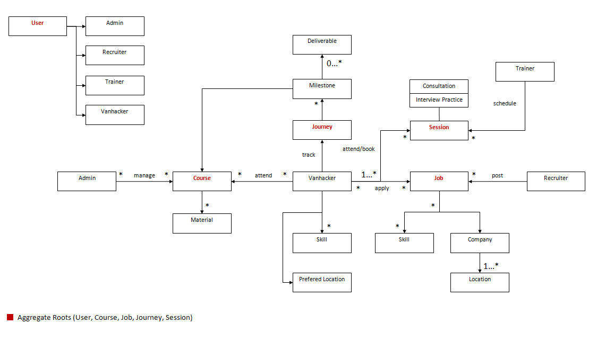

# VanHack Platform - Backend

[](https://www.travis-ci.org/psantos10/vanhack-backend)
[](https://gemnasium.com/github.com/psantos10/vanhack-backend)
[](https://codeclimate.com/github/psantos10/vanhack-backend/maintainability)

DEMO: https://vanhack-backend.herokuapp.com/



## Requirements

* Ruby 2.5.1
* Rails 5.2.0
* PostgreSQL 10.3

## Setup

1. Fork the respository and clone your fork

```console
$ git clone https://github.com/<YOUR_USERNAME>/vanhack-backend
$ cd vanhack-backend
$ bundle install
```

2. Setup your database

```console
$ bin/rails db:create
$ bin/rails db:migrate
$ bin/rails db:seed
```

### Run tests

```console
$ bin/rspec
```

Use GraphiQL.app to test the API
- https://github.com/skevy/graphiql-app

## Contributing

### How To Contribute

1. Fork the [repository in GitHub](https://github.com/psantos10/vanhack-backend)
2. Create your feature/fix branch (`git checkout -b special-feature`)
3. Make sure all tests pass (`bundle exec rspec`)
4. Commit your changes (`git commit -am 'feature: Summarize change'`)
5. Push to the branch (`git push origin special-feature`)
6. [Create new pull request](https://github.com/psantos10/vanhack-backend/pulls)
